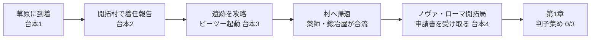

# 序章イベント台本＆開拓村イベント案

Sep 21, 2026 · @みねい

## 1. 確定した設定

剣士・炎魔術師・雷魔術師の3人は、東方都市国家から派遣された移住の先遣隊で、ノヴァ・ローマの開拓事業に協力しながら「故郷のみんなが住める土地を拓く」ことがゲーム全体のゴールになる。

| 項目 | 内容 |
| --- | --- |
| 3人の立場 | 東方からの派遣開拓者。働き手としては受け入れ済みだが、故郷の民を呼ぶ許可はまだない |
| キャラ付け | 剣士＝ちょっと変な女剣士で隊長。炎魔術師＝真面目。雷魔術師＝ギャル |
| 会話の役割 | 剣士が決めてズレた一言を言う。炎が正論と説明を担う。雷がプレイヤーの本音を代弁する |
| 全体のゴール | 故郷のみんなが住める土地を拓く（最後まで書き換えない大目標） |
| 判子3つ | 元老院・執政官府・法官会議の承認。窓口は魔導院・遺物管理局・旧市街。3つ揃って初めて移住の手続きを始められる |
| 進行の手応え | 申請書の押印欄が0/3から埋まる。判子を取るたびに故郷から手紙が届く |
| 章との対応 | 第1章で申請受理、第2章で入植予定地の安全確認（封印調査）、第3章で三者の対立により審査凍結、第4章で解決して入植 |

序章の流れは次のとおり。どの段階でも「次に行く場所」は1つだけにする。



目的表示は2段にする。大目標は常時表示で、当面の目標だけが「村に着任を報告する」「遺跡の機械を止める」「ビーツーを都に届け出る」「判子を集める 0/3」と切り替わる。

## 2. 台本1：草原に到着

飛行艇が去った直後の7行で、全体のゴール（故郷のみんなを呼ぶ）と当面の数字（判子3つ）と次の行き先（村）を渡す。場所は開拓村の手前のフィールド。

> （飛行艇が上昇して遠ざかる）
>
> 剣士「着いた〜……。おしりが痛いです。飛行艇、椅子が石でした」
>
> 雷「それな〜。てかもう帰りたいんだけど」
>
> 炎「帰れません。判子を3つもらうまでは。3つ揃って、やっと故郷のみんなを呼ぶ手続きが始められます」
>
> 雷「……それ、何回聞いても重いんだけど」
>
> 剣士「重いです。なので私は数だけ覚えました。3つです」
>
> 炎「……隊長がそれで大丈夫ですか。まずはあの村に着任の報告です」
>
> 剣士「はい。村はあっちです」
>
> （操作開始。大目標「故郷のみんなが住める土地を拓く」、当面の目標「村に着任を報告する」）

演出メモ

- 操作が戻った時点で村の入口が画面内に見えるようにする。
- 「東方」という地名はここでは出さない。村で最初に話す相手に言わせる。
- エンディングで同じ草原に家と畑が並ぶ絵を置くため、マップの構図を覚えやすくしておく。

## 3. 台本2：村長に着任を報告する

依頼を受けるのではなく、開拓者の務めとして自分から遺跡へ向かう形にする。出身が東方であること、3人しかいないこと、土地に入れない理由の3点をここで伝える。

> 村長「東方の開拓さんか。都から話は聞いとる。……3人？ 聞いてたより少ないな」
>
> 剣士「少数精鋭です。精鋭の意味はあとで調べます」
>
> 炎「着任の報告に参りました。開拓予定地を見せていただけますか」
>
> 村長「見せたいのは山々だが、畑の先には行けん。奥の穴から鉄の虫が出るようになってな」
>
> 雷「鉄の虫？ なにそれウケる。……ウケない感じ？」
>
> 村長「先月、牛が2頭やられた」
>
> 雷「ウケないやつだ」
>
> 炎「土地の安全確保は開拓者の務めです。見てきます」
>
> 村長「助かる。空き家を使ってくれ。いずれあんたらの同郷が住む家だ、好きにしていい」
>
> 剣士「では一番日当たりのいい家にします。おばあちゃんが寒がりなので」
>
> （当面の目標「遺跡の機械を止める」）

演出メモ

- 「鉄の虫」は遺跡から出てくる小型の警備機械。村人は旧世紀の機械を知らないので、見たままの言葉で呼ばせる。
- 空き家は3人の宿舎になり、セーブと休息の地点を兼ねる。
- 剣士の最後の一言で、ゴールが制度の話ではなく身内の話だと伝える。

## 4. 台本3：遺跡最深部、ビーツー起動

ここまで守りの手段なしで進んできた3人に、最初のかばう役が入る場面。起動の直後に防衛ドローン戦を置き、ビーツーが実際にかばうところをプレイヤーに体験させてから、連れて帰る話をする。

### 起動

> 雷「なんか丸いのいる。え、かわいくない？」
>
> 炎「触らないでください。旧世紀の機体です。何が起きるか——」
>
> 剣士「触りました」
>
> 炎「隊長！」
>
> ？？？「……適合者を確認。再起動。型式、B-2。任務……地球圏……調査……」
>
> ？？？「警告：外宇宙からの——（ノイズ）」
>
> 雷「しゃべった！」
>
> 剣士「ビーツーさんですね。よろしくお願いします」
>
> （警報。施設防衛ドローンが起動する）
>
> ビーツー「防衛システムの起動を検知。護衛対象を設定。……あなたたちを守ります」
>
> （ビーツー加入。ボス戦。1ターン目に「かばう」の操作案内）

### ボス戦後

> 雷「この子、さっきウチのことかばってくれたんだけど。連れて帰ろ」
>
> 炎「旧世紀の遺物の持ち出しは、都への届け出が要ります」
>
> 剣士「では届け出ます。どうせ判子をもらいに行くので」
>
> 炎「……ついでのように言わないでください」
>
> ビーツー「同行を希望します。記憶領域の大半が破損。あなたたち以外に、照合できる対象がいません」
>
> （当面の目標「村に戻って報告する」）

演出メモ

- 「適合者を確認」は剣士が現代にただ一人のニュータイプであることの伏線。ここでは誰も気に留めず、笑える場面として流す（企画書v4.5の3.2と10.5）。警告の「外宇宙からの——」はノイズで切る。ここでは誰も反応させず、第1章の章ボスで回収する。
- 雷の「かばってくれた」は、直前の戦闘でプレイヤーが実際に見たことなので、説明を足さない。
- 序章で「謎の剣客」（侍）を出す場合は、遺跡の入口で剣士に一言かけて去る程度に留める。同じ東方の出身なので、剣士だけが顔を知っている。

## 5. 台本4：村への帰還と、都の開拓局

村では薬師と鍛冶屋が合流し、都では申請書の現物が出てくる。冒頭で口にしただけの「判子3つ」が、ここで初めて目に見える物になる。

### 村への帰還

> 村長「鉄の虫が止まった……。3人で、本当にやったのか」
>
> 剣士「4人です。1人は丸いです」
>
> 村長「畑の先はあんたらの土地だ。好きに拓いてくれ。それと、うちの若いのを2人連れていけ」
>
> 薬師「薬草が採れるようになったお礼。それに、あなたたち回復の手段がないでしょう。見ていられないの」
>
> 鍛冶屋「農具ばかり打つのも飽きた。その剣、刃が泣いてるぞ。道中で研いでやる」
>
> （薬師・鍛冶屋加入。畑の先のマップが1区画開く。当面の目標「ビーツーをノヴァ・ローマに届け出る」）

### ノヴァ・ローマ開拓局

> 係官「東方の派遣開拓者、着任確認。……で、移住申請だったな。これだ」
>
> （移住申請書。押印欄が3つ空いている）
>
> 係官「元老院、執政官府、法官会議。窓口は魔導院、遺物管理局、旧市街。順番は問わん」
>
> 炎「申請すれば押していただけるのですか」
>
> 係官「よそ者の申請に喜んで判子を押す者はおらん。顔を売ってこい。どこも人手が足りん」
>
> 雷「要するにパシリじゃん」
>
> 剣士「パシリなら得意です。3つですね。覚えています」
>
> 係官「その浮いてるのは遺物管理局の管轄だ。届け出は局長に直接しろ」
>
> （地図が開き、印が3つ付く。当面の目標「判子を集める 0/3」。第1章開始）

演出メモ

- 係官の説明は4行以内に収める。三者の人物や立場は、窓口を訪ねた先で本人に話させる。
- ビーツーの届け出を遺物管理局に向けることで最初の行き先の目安を示すが、順番は強制しない。
- 村から都までの街道（平原地帯）を薬師と鍛冶屋の見せ場の区間にする。脆弱薬→大技、武器を研ぐ→剣士をここで体験させる。

## 6. 開拓村のイベント案

必須は着任報告と帰還報告の2つだけで、残り8つは任意にする。任意イベントはどれも1〜3行で終わる短さにし、ゲームのルールか後の展開のどちらかを1つ仕込む。

| # | 区分 | 場所・相手 | 内容 | 仕込むもの |
| --- | --- | --- | --- | --- |
| 1 | 必須 | 村長の家 | 着任報告（台本2） | 出身、土地に入れない理由、宿舎 |
| 2 | 必須 | 村長の家 | 帰還報告（台本4）。薬師と鍛冶屋が合流し、畑の先のマップが開く | 開拓が進むと地図が広がるという見せ方 |
| 3 | 任意・遺跡前 | 薬屋（薬師） | 回復薬が品薄で、1人1本しか売ってくれない。「薬草の採れる場所が鉄の虫の向こうなの」 | 回復が貴重というルールを物語で説明する。加入の動機にもなる |
| 4 | 任意・遺跡前 | 鍛冶場（鍛冶屋） | 剣士の剣を見て無料で研いでくれる。次の戦闘1回だけATKが上がる | 「武器を研ぐ」の予告。準備すると強くなる体験の最初の1回 |
| 5 | 任意・遺跡前 | 村外れ | 謎の剣客が素振りをしている。剣士だけが顔を知っていて、話しかけると模擬戦（戦闘チュートリアル）ができる | 侍の初登場。東方の同郷であること。剣気解放→龍槌閃の練習 |
| 6 | 任意・遺跡前 | 畑の柵 | 柵の向こうに鉄の虫が1体だけ見える。近づくと最初の実戦になる | 敵シンボルの見方、敵情報の表示、逃げられること |
| 7 | 任意・いつでも | 空き家（宿舎） | 3人の部屋会話。雷が故郷の妹の話をし、炎が申請の書類を整理し、剣士が床で寝ている | 3人の素顔。セーブと休息の地点 |
| 8 | 任意・いつでも | 郵便箱 | 故郷からの最初の手紙が届いている。「着いたら知らせてね」 | 以降、判子を取るたびに手紙が届く受け取り口 |
| 9 | 任意・いつでも | 村の子ども | 「東方ってどこ？ 遠い？」「飛行艇で3日です。椅子は石です」 | 出身地の補足。通貨が違うこと（東方元の話）もここで触れられる |
| 10 | 任意・帰還後 | 村の古老 | 遺跡を「眠りの穴」と呼ぶ言い伝えを話す。「穴の底で、最初の人たちは千年眠っておった」 | コールドスリープの口承。記録と言い伝えの違い（第1章旧市街ルートの教育要素への前振り） |

帰還後は村人全員の台詞を差し替える。呼び方が「よそ者」から「開拓さん」に変わるだけでも、最初の達成感が出る。

村は第1章以降も開拓の進み具合を映す場所として使う。判子が1つ埋まるごとに、空き家の1軒に明かりが灯る、畑が1面増える、といった変化を1つずつ足していくと、大目標の進行が数字以外でも見える。

## 7. 序章の探究学習

序章では知識ではなく「探究の型」を渡す。開拓とは知らない土地を調べることなので、3人の仕事そのものを探究の過程として描く。型は学校の探究の時間と同じ4段階（課題の設定→情報の収集→整理・分析→まとめ・表現）に、振り返りを足した5歩にする。

| 歩 | ゲーム内の操作 | 探究で言うと |
| --- | --- | --- |
| 1. 問いを立てる | NPCの困りごとや3人の雑談から、問いが1行で表示される | 課題の設定 |
| 2. 仮説を選ぶ | 選択肢2〜3個から選ぶ。雷が雑な仮説を口にして敷居を下げる | 仮説の設定 |
| 3. 確かめる | 聞き取り、観察、記録を読む、実際に試す、のどれかを村や戦闘で行う | 情報の収集 |
| 4. 考える | 集めた手がかりを並べ、炎が整理する。仮説を直すかどうかを選ぶ | 整理・分析 |
| 5. 書き残す | 開拓ノートに「わかったこと」と「次の問い」が1行ずつ残る | まとめ・表現、振り返り |

**設計ルール**

- NPCは答えを言わない。答えは確かめた結果として出る。
- 報酬は「当たったか」ではなく「仮説を立てて確かめたか」に出す。外した仮説にも、なぜ違ったかの説明が付いてノートに残る。
- 1つの探究は3〜5分。飛ばしても遺跡は抜けられるが、やると少し楽になる。
- 必ず「次の問い」で終える。答えが出て終わりにしない。
- 確かめ方を毎回変える。序章だけで、聞き取り、一次資料、観察記録、対照実験、試作比較、やり直しの6種類を体験させる。
- 役割を固定する。雷が仮説を出し、炎が確かめ方を決め、剣士が「なんとなく」で言い当てて2人を困らせる。

**開拓ノート**

考察録（教育要素の第4層）の入口になる手帳で、序章の最初の探究で村長から渡される。1件は次の4行で記録される。

```
【問い】　　　なぜ薬屋に回復薬がないのか
【最初の仮説】誰かが買い占めている
【わかったこと】薬草の採れる場所が、鉄の虫の向こうにあった。
　　　　　　　在庫帳の数字は先月から減り続けていた
【次の問い】　鉄の虫は、いつから、なぜ出るようになったのか
```

「次の問い」が別の探究の【問い】につながるので、ノートをたどると村の問題が1本の線になる。最後の問いは序章では解けず、第1章以降に持ち越される。

## 8. 村のサブイベントに入れる探究

6節の任意イベントのうち5つを探究の形にする。確かめ方が1つずつ違い、問いが次の問いにつながって遺跡へ向かう流れになる。

| # | 場所 | 問い | 仮説（選択肢） | 確かめ方 | わかること | 身につく探究の技 | 報酬 |
| --- | --- | --- | --- | --- | --- | --- | --- |
| 1 | 薬屋 | なぜ回復薬がないのか | 買い占め／作り手不足／材料が採れない | 薬屋の在庫帳を読む（数字が先月から減っている）。村人2人に聞く（1人は噂、1人は自分で見た話） | 薬草の群生地が鉄の虫の向こうにある | 記録（一次資料）と噂を分ける。数字の変化を読む | 回復薬1本、開拓ノート |
| 2 | 畑の柵 | 鉄の虫はいつ出るのか | 夜に出る／雨の日に出る／決まっていない | 村人3人の証言が食い違う。柵のそばで時間を変えて3回見張る | 時刻や天気ではなく、人が畑に近づくと出る。「夜に出る」と言った村人は、夜に見回りをしていただけ | 証言の食い違いを観察で確かめる。相関と因果の違い | 最初の実戦で先手を取れる |
| 3 | 鍛冶場 | 研ぐと何が変わるのか | 力が強くなる／当たる面が狭くなる／気のせい | 研ぐ前と後で、同じ剣士が同じ技で同じ案山子を斬る | 刃先が細いほど同じ力でも深く入る（圧力＝力÷面積） | 対照実験。変える条件は1つだけにする | 次の戦闘1回だけATK上昇 |
| 4 | 村の古老 | 「眠りの穴で最初の人たちは千年眠っていた」は本当か | 全部作り話／全部本当／一部だけ本当 | この場では確かめられない。仮説をノートに書いて保留し、遺跡の最深部を見た後で戻る | 人は眠っていなかったが、「眠らせておく場所」だったのは本当。言い伝えは形を変えて事実を運ぶ | 仮説を保留して後で検証する。口承の史料としての価値と限界 | 考察録「口承と記録」 |
| 5 | 村の子ども | （子どもから問われる）なんで遠くから来たの？ | 3人がそれぞれ答える。どの答えを子どもに伝えるかを選ぶ | 子どもの反応を見る。難しい言葉では伝わらない | 同じ事実でも、相手によって伝わる言い方が違う | まとめ・表現。相手に合わせて説明する | 3人の素顔の会話 |

**つながり方**

薬屋の「次の問い」が畑の柵の問いになり、畑の柵の「次の問い」（なぜ人に反応するのか、誰が何を守らせているのか）が遺跡へ向かう動機になる。村長に言われたから行くのではなく、自分たちで調べた結果として遺跡に行き着く形にできる。

**最初の夜の振り返り**

序章で最初に赤シンボルを倒した夜、野営で炎が「今日いちばん困ったことは何でしたか」と聞く。選択肢（回復できない、敵の攻撃が痛い、先に動かれる、など）を選ぶと、開拓ノートにその日の振り返りが1行残る。選んだ内容に応じて、翌日に役立つ助言が1つ返ってくる。探究の「振り返り」を、毎晩の習慣として最初に置く。

## 9. キャラクターイベントに入れる探究

序章で加入する6人と侍に、1つずつ探究を持たせる。戦闘そのものを実験の場にして、プレイヤーが自分でデータを取る。

| キャラ | 問い | 確かめ方 | わかること | 探究の技 | 後への効き方 |
| --- | --- | --- | --- | --- | --- |
| 炎魔術師 | 印は何回結んでから撃つのが得か | 遺跡の戦闘で、印0回・1回・2回・3回のダメージをノートに記録する。表が埋まると、炎が1手あたりの効率を計算する | 雑魚はすぐ撃つ方が得、硬い相手は溜める方が得。答えは相手で変わる | 自分でデータを取る。表にして比べる。「場合による」を条件付きで言い切る | 準備型の職の使い方を、説明ではなく自分の数字で理解する |
| 雷魔術師 | なんでウチが先に動けるの？ | 雷「速いからじゃね？」で終わらせず、3戦ぶんの行動順を見て、4戦目の順番を予想する | 行動順は敏捷で決まる。当てられれば理解できている | 雑な仮説でいいから先に言う。予想してから確かめる | 行動順を読む癖が付く。時魔術師の加入時に活きる |
| 剣士 | 隊長の「なんとなく」は当たるのか | 剣士が「あっちに何かいます」と言うたびに炎が当たり外れを記録する。10回ぶん溜まると結果が出る | 10回中9回当たる。炎「偶然で9回以上当たる確率は約1%です。……偶然ではありません」。理由は分からないまま保留する | 偶然かどうかを回数と確率で考える。分からないことを分からないまま持っておく | 剣士がただ一人の適合者であることの伏線。第2章で回収する |
| ビーツー | ビーツーは何者で、何を警告しようとしたのか | 手がかりは3つだけ（型式B-2、製造年は宇宙世紀853年、警告の途中で切れた言葉）。3人がそれぞれ仮説を言い、ノートに保留する | 序章では解けない | 長く持ち続ける大きな問いを立てる。手がかりと推測を分けて書く | ゲーム全体を貫く問いになる。記憶データを回収するたびにノートが更新される |
| 薬師 | どの配合がいちばん効くか | 加入後の街道で、薬草の量だけを変えた3本を試作し、戦闘で1本ずつ使って回復量を比べる | 量を増やすほど効くわけではない。ある量を超えると効き目が頭打ちになり、副作用が出る | 条件を1つだけ変えて比べる。「多いほど良い」を疑う | 用量と効き目の関係。劇薬の仕組みの前振り |
| 鍛冶屋 | なぜ硬い剣ほど折れやすいのか | 街道の野営で、焼き入れだけした刃と、焼き戻しもした刃を岩に打ち付ける | 硬さと粘り強さは両立しにくい。ちょうどいい所を探すのが職人の仕事 | 二律背反を見つける。最適な点を探す | 武器強化のレシピに「硬さ寄り・粘り寄り」の選択肢が出る |
| 侍（謎の剣客） | なぜ当たらないのか | 村外れの模擬戦は最初は必ず負ける。負けた理由の仮説（遅い、読まれている、力み）を選んで再戦する。侍は答えを言わず「もう一度」とだけ言う | 攻撃の前に剣気解放を使うと侍が受けに回る。準備してから撃つと通る | 失敗→原因の仮説→やり直し。1回で当てなくていい | 第4章の時間ループと同じ構造を、最初の10分で体験させる |

模擬戦の「必ず負ける」は一撃死でゲームオーバーになる本戦とは別扱いの稽古として、負けても何も失わないことを最初に侍に言わせる。

**3人の探究での役割**

| キャラ | 役割 | 口ぐせ |
| --- | --- | --- |
| 雷魔術師 | 仮説を出す人。雑でも先に言う | 「たぶん〜じゃね？」 |
| 炎魔術師 | 確かめ方を決める人。記録を付ける | 「確かめましょう。条件を揃えてください」 |
| 剣士 | 直感で言い当てる人。理由は言えない | 「合ってます。理由はありません」 |

この3人の型は、探究で大事な3つの力（発想、検証、直観）を1人ずつに割り振ったものになる。剣士の直観を炎が検証しようとして検証しきれない、という関係が、後に剣士の資質が明らかになったときの驚きにつながる。

## 10. 未決事項

- [x] 遺跡の場所。開拓村の奥にある「コールドスリープ分室跡」とする。本施設は北方凍土にあり、宇宙世紀末期に機材と機体を分散保管した分室の1つという位置付け（企画書v4.0の2.2）。
- [x] 薬師と鍛冶屋は開拓村の住人で、遺跡攻略後に村で加入する。
- [x] 侍は村外れの模擬戦（任意）で初登場する。
- [ ] 3人とビーツーの名前。本書は職業名で書いているので、決まり次第差し替える。
- [ ] 故郷が移住を必要とする理由。冒頭では語らず手紙で少しずつ見せる方針だが、中身（土地が痩せた、など）は未定。
